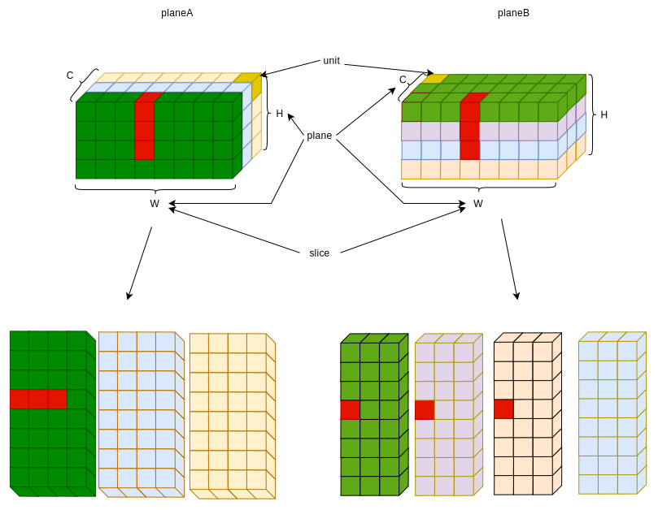

# README

## quickly start

```bash
$ cd build
$ cmake ..
$ make

$ ls -l
```

## function

- feature cube address generate 
- Abstraction at different levels


## Tensor descriptor

### microarch tensor

#### num/dim

  * byte number:  byteNum = 0 < byte number << 64
  * unit number:  unitNum
  * slice number: sliceNum
  * plane number: planeNum
  * cube number:  cubeNum

#### skip/stride

  * unitSkip  = `1<<static_cast<int>(ceil(log2(tensorDesc.byteNum)))`
  * sliceSkip = unitNum  \* unitSkip;
  * planeSkip = sliceNum \* sliceSkip;
  * cubeSkip  = planeNum \* planeSkip;





### arch tensor


#### father tensor


#### sub tensor


#### convert to microarch tensor

